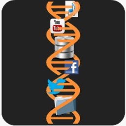

# DNA Cloud 3.14

- DNA Cloud 3.14 is an even updated version which is more efficient than v2.0. The user has the option to use two different algorithams i.e. Goldman and Golay to encode/decode any type of file. This version also includes the number of chunks of actual DNA required to store the given data. This info will be available in the .dnac file generated while encoding. 

- DNA Cloud has been developed for the sole-purpose of generating a user-friendly, interactive environment for users to envisage their DNA data storage.

## About Us

### Gupta Lab

- Research in our lab currently focuses on two aspects of information processing viz. deciphering the information processing principles in life (systems biology) and building a computer out of bio-molecules (synthetic biology). The key expertise of the lab is in error-correcting codes. We also work in classical and quantum information processing principles with expertise in coding theory and its wide variety of applications in Information and Communication Technology (ICT). 

- Our research areas includes mathematics and its elegant applications in Emerging Technologies: DNA digital data storage, DNA computing, chemical computing, coding theory, quantum computing, quantum machine learning, quantum error correction, cryptography, quantum algorithms, synthetic biology, DNA nanotechnology and bioinformatics.

- Visit `guptalab.org` to know more about our work in the area of emerging technolgoies and explore various other softwares.

- Please reach us to at `dnacloud@guptalab.org` for any queries related to this software.

- For more information about DNA Cloud 3.14, check out `www.guptalab.org/dnacloud`       

**&copy; 2022 Gupta Lab**

## Instructions

To run the application, type the following command on command line:

> python MainFrame.py

## Required Libraries/Dependencies

**PyQt**

- The latest version can be installed from &copy; [Riverbank Computing Limited](https://www.riverbankcomputing.com/software/pyqt/)

- The GPL version of PyQt5 can also be installed from [PyPI](https://pypi.org/project/PyQt5/): > pip install PyQt6

